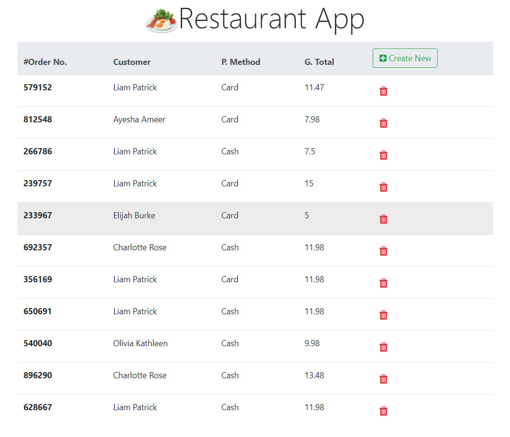

# Angular Restaurant Application
A simple Restaurant app using Angular, Bootstrap and .Net Framework ASP.NET Web API.

## Ordering process

## All current Orders 

---
## Installation via the following scripts
### Microsoft SQL Server Management Studio
 * Run the SQLDBScript.sql to create the Database
### Angular
 * Run npm install command using node packet manager. [Download node here.](https://nodejs.org/en/)
### WebAPI
 * Run following command in the NuGet-Packet Manager Console to enable CORS (Cross Origin Resource Sharing)
    * Install-Package Microsoft.AspNet.WebApi.Cors 

 * If command is not working try the following commands instead: 
    * Update-Package Microsoft.AspNet.WebApi -reinstall
    * Install-Package Microsoft.AspNet.WebApi.Core
